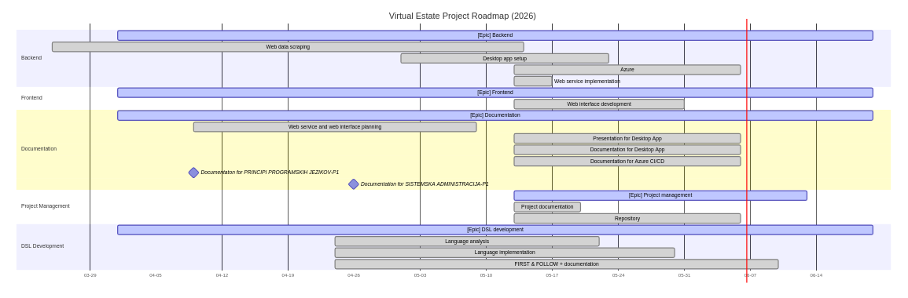
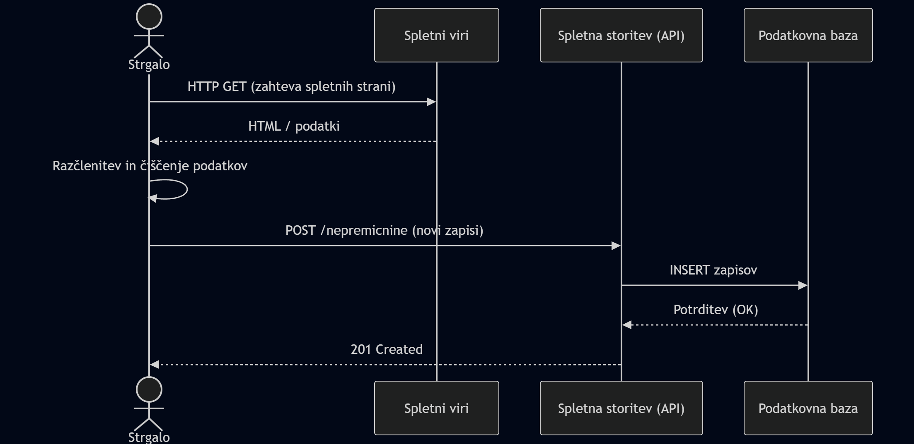
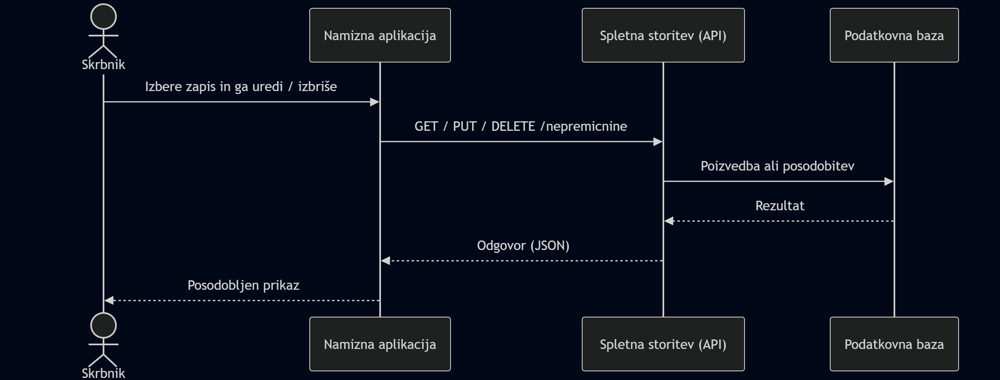
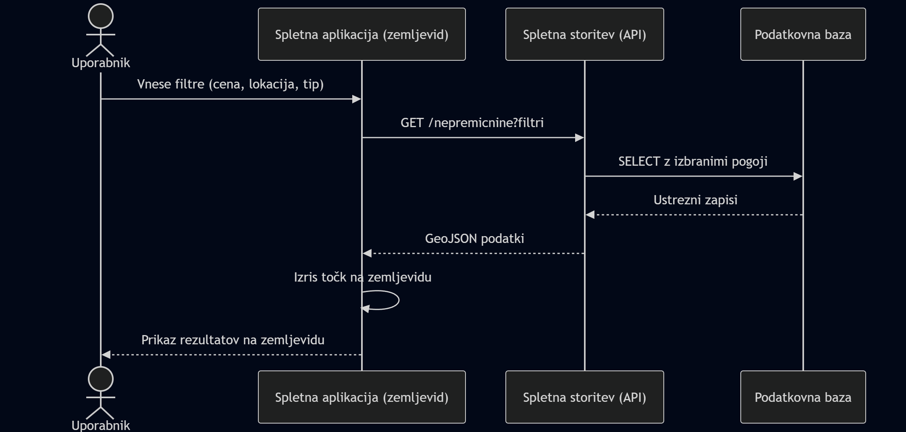
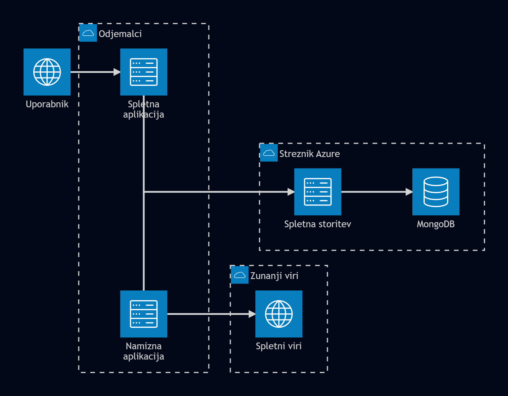
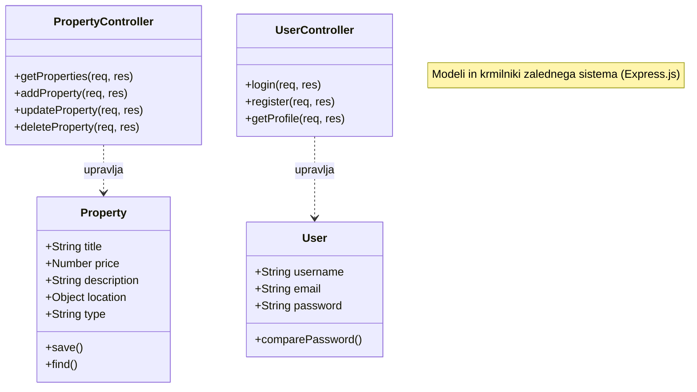
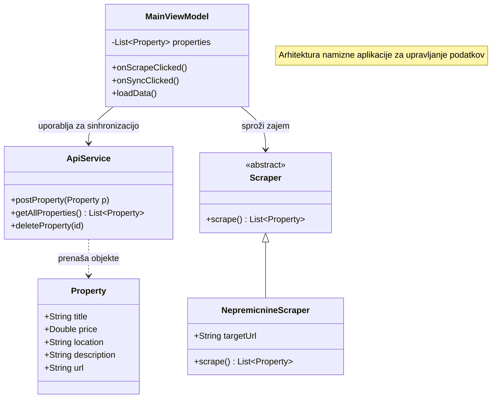

# Dokumentacija
Člani skupine: Andrej Nemanič, Nik Šignjar Žilavec
Povezava do repozitorija s kodo: https://github.com/andrej-nemanic/VirtualEstate_Project.git
Ganttov diagram (od vzpostavitve projekta in do konca projekta (do 3. letnika))

## 1. Primeri uporabe

Naša aplikacija rešuje problem iskanja nepremičnin na različnih spletnih straneh. Aplikacija strga podatke z različnih spletnih virov, te podatke nato pošlje v oddaljeno podatkovno bazo za nadaljno uporabo. S podatki upravljamo preko namizne aplikacije, ki deluje kot upravljalec podatkovne baze (DBMS). Ti podatki so na koncu uporabljeni v spletni aplikaciji, kjer se uporabnikom prikažejo na interaktivnem zemljevidu. Uporabnik lahko filtrira in išče podatke glede na svoje želje.

### 1.1. Zajem podatkov

En primer uporabe je zajem podatkov s spletnih virov. Uporabnik s pomočjo namizne aplikacije zajame vire, in jih s pomočjo spletne storitve pošlje v podatkovno bazo.

### 1.2 Upravljanje podatkov v podatkovni bazi

Drugi primer uporabe je urejanje podatkov s pomočjo namizne aplikacije. Uporabnik uredi podatke, pošlje spremembe na spletno storitev, ki potem ažurira podatke v podatkovni bazi.

### 1.3 Iskanje in filtriranje podatkov na zemljevidu 

Še en primer uporabe je iskanje in filtriranje podatkov na spletni aplikacji. Aplikacija prejme filtre, in glede na te pridobi podatke iz podatkovne baze, ter jih prikaže na zemljevidu.

## 2. Arhitektura programske rešitve

Arhitektura sistema VirtualEstate temelji na troslojni zasnovi (odjemalec-strežnik-podatkovna baza). Celotna rešitev je zasnovana tako, da so različne komponente (spletni vmesnik, zaledna storitev) izolirane v Docker vsebnikih, kar omogoča enostavno namestitev v okolje Azure.

### 2.1 Tehnologije
V projektu so uporabljene naslednje tehnologije:
*   **Programski jeziki:** 
    *   **JavaScript:** Uporabljen za razvoj spletne aplikacije (React) in zalednega sistema (Node.js).
    *   **Kotlin:** Uporabljen za razvoj namizne aplikacije za upravljanje podatkov (DBMS).
*   **Podatkovna baza:** **MongoDB Atlas** – dokumentna NoSQL podatkovna baza v oblaku, izbrana zaradi fleksibilnosti pri shranjevanju raznolikih podatkov o nepremičninah.
*   **Komunikacijski protokoli:** 
    *   **TCP/IP:** Temeljni protokol sklada za omrežno povezovanje.
    *   **HTTP/HTTPS:** Uporabljen za komunikacijo med odjemalci in REST API-jem.
*   **Spletni strežnik:** **Node.js** z ogrodjem **Express.js** za izvajanje zalednih storitev.
*   **Interpreter/Prevajalnik:** 
    *   **V8 Engine:** Interpreter za JavaScript znotraj Node.js okolja.
    *   **JVM (Java Virtual Machine):** Okolje za izvajanje Kotlin namizne aplikacije.
    *   **Vite:** Orodje za gradnjo frontenda, ki omogoča hitro razvojno izkušnjo.

### 2.2 Knjižnice in API
*   **React:** Izbran za razvoj spletnega vmesnika zaradi komponentne strukture, kar omogoča ponovno uporabo kode in hitro osveževanje UI.
*   **Leaflet API:** Odprtokodna knjižnica za interaktivne zemljevide, ki rešuje problem vizualizacije nepremičnin na zemljevidu.
*   **Mongoose / MongoDB Driver:** Knjižnici, ki rešujeta problem komunikacije s podatkovno bazo in omogočata definiranje shem za dokumente.
*   **Axios:** Uporabljen za asinhrono komunikacijo med frontendom in backendom.
*   **Express.js:** Poenostavlja razvoj RESTful API-jev in obdelavo HTTP zahtev.

### 2.3 Komunikacija
*   **Uporabljeni protokoli:** REST (preko HTTP) za prenos JSON podatkov.
*   **Odprta vrata (Ports):**
    *   `3000`: Vrata zaledne spletne storitve (API).
    *   `5173`: Vrata spletnega vmesnika (Frontend).
    *   `9000`: Vrata za Webhook poslušalca (avtomatizacija CD procesa).
    *   `22`: Vrata za SSH dostop do Azure virtualne naprave.

### 2.4 Razredni diagrami

V nadaljevanju sta podana razredna diagrama za ključna dela sistema.

#### 2.4.1 Razredni diagram zalednega sistema (Node.js)
Prikazuje strukturo modelov nepremičnin, uporabnikov in krmilnikov, ki skrbijo za poslovno logiko.

#### 2.4.2 Razredni diagram namizne aplikacije (Kotlin)
Prikazuje strukturo namizne aplikacije, vključno z moduli za zajem podatkov (scraping) in komunikacijo z API-jem.

