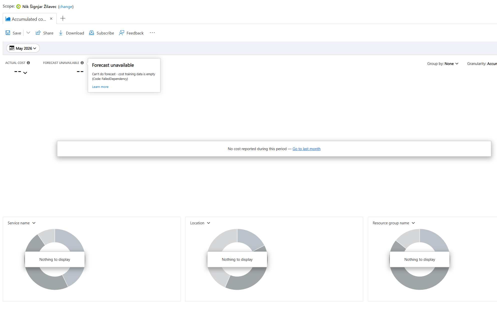

# Analiza portala Azure
## Vprašanje 1: Kje in kako omogočite "port forwarding" (posredovanje vrat)?
V okolju Azure se posredovanje vrat in odpiranje omrežnega prometa izvaja preko Network Security Group (NSG), ki deluje kot požarni zid za virtualno napravo.
Postopek:
1. V stranskem meniju virtualne naprave izberemo Network settings pod zavihkom Networking.
2. Kliknemo na gumb Create port rule -> Inbound port rule.
3. Nastavimo:
    - Source: Any
    - Source port ranges: *
    - Destination: Any
    - Service: Custom
    - Destination port ranges: [Vpišemo vrata naše aplikacije, npr. 3000]
    - Protocol: TCP
    - Action: Allow
4. Kliknemo Save.

## Vprašanje 2: Kakšen tip diska je bil dodan vaši navidezni napravi in kakšna je njegova kapaciteta?
Podatke o disku najdemo, če v meniju virtualne naprave kliknemo na zavihek Disks.
- Tip diska: Premium SSD LRS.
- Kapaciteta: 30 GiB.

## Vprašanje 3: Kje preverimo stanje trenutne porabe virov v naši naročnini ("Azure for students")? Namig: stanje porabe bo vidno komaj 24ur po vpostavitvi.
Stanje porabe preostalih sredstev (od začetnih 100 €) in porabljenih ur virtualnih naprav spremljamo na portalu Azure Sponsorship.
Do tja pridemo tako, da obiščemo povezavo: www.microsoftazuresponsorships.com, kliknemo gumb "Check Your Balance" (Preveri stanje) in se
prijavimo s študentskim e-naslovom (s tistim računom, s katerim je vodja skupine aktiviral Azure).

Potem v iskalno vrstico na vrhu Azure portala vpišemo Cost Management + Billing ali pa obiščemo neposredno povezavo Microsoft Azure Sponsorship. Tam se izpiše graf porabe, preostali znesek in število dni do poteka naročnine.

Na podani zaslonski sliki grafa še ni bilo nič prikazano, saj se podatki osvežijo približno 24 ur po zagonu prvih virov, od vzpostavitve pa še ni minilo 24 ur.

